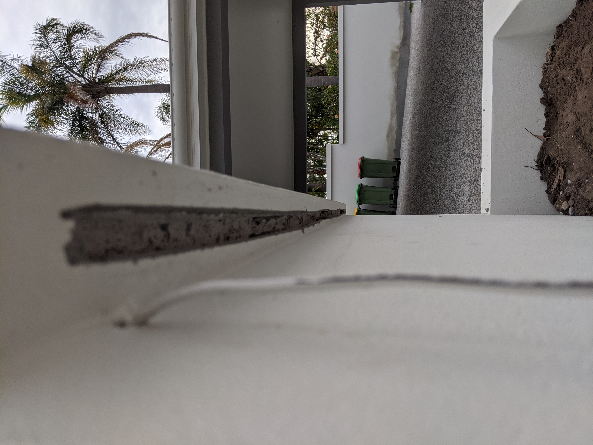

We were attempting to install an LED strip to the under side of this entrance planter box. We noticed that grout had been placed inside of the cavity where we were meant to be mounting the light strip. This placed us in a sticky situation as we had to chisel out the grout without knocking the entire lip off the planter box.

From the picture above you can see the lip where the LED strip should sit, but it isn't deep enough for the aluminium housing. So chisel away I go...

I thought I could get away without cracking the lip...

